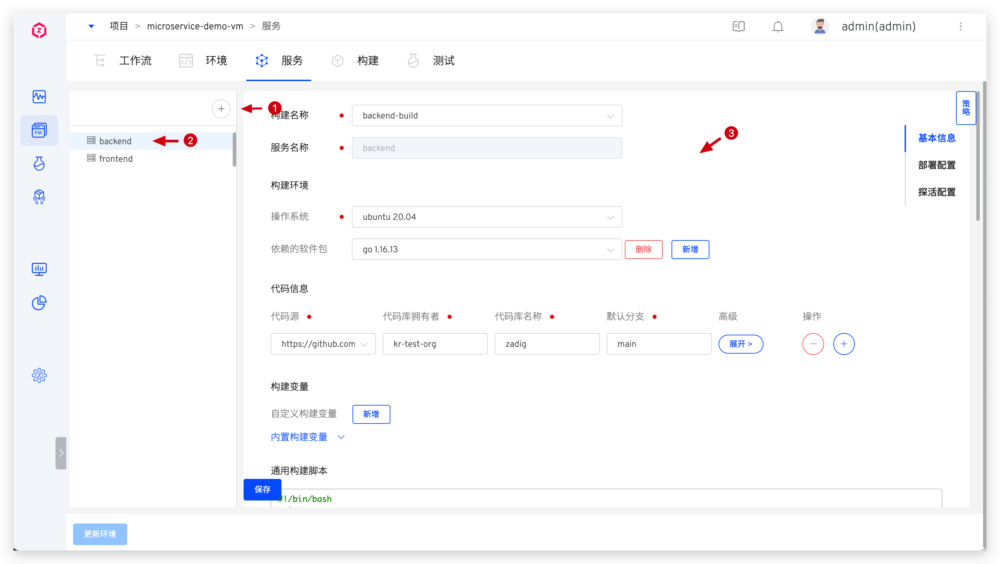

本文介绍主机项目中的服务相关操作。

## 新增服务

点击添加服务按钮 -> 输入服务名称 -> 填写基本信息、部署配置及探活配置。

### 基本信息

配置构建脚本，定义服务的构建打包过程。构建配置细节可参考[构建模块](/dev/project/build/)。

### 部署配置

配置部署脚本，定义服务的部署过程。

说明：
- 部署方式：
    - `本地直连部署`：直接在 Zadig 所在集群中执行部署操作，需确保 Zadig 系统能连通或访问到脚本中的主机地址。
    - `使用 SSH Agent 远程部署`：安全登录到目标机器，执行部署操作。
- 部署脚本和构建脚本共享存储卷，在构建脚本中生成的包在部署脚本中直接获取。
- 部署脚本可以使用构建脚本中系统内置变量，构建包需使用 `$PKG_FILE` 获取。

### 探活配置

服务部署成功后，按照一定规则对服务进行探活检测。

字段说明：
- `协议`：支持 HTTP、HTTPS 和 TCP。
- `路径`：HTTP/HTTPS 请求的健康检查路径。
- `端口`：支持 1 - 65535 端口。
- `响应超时`：超出设定时间，判断为不健康。
- `高级设置`：
    - `探测间隔`：两次探活请求的间隔时间，默认 2s。
    - `健康阈值`：从不健康变为健康的连续探测次数。
    - `不健康阈值`：从健康变为不健康的连续探测次数。

## 更新服务

- 选择需要修改的服务，修改服务配置，点击`保存` -> 点击`更新环境` -> 在弹框中选择需要更新的环境。

## 删除服务

- 点击服务右侧的删除按钮将服务删除。删除服务后，若需将服务从环境中也删除，点击`更新环境`即可。

